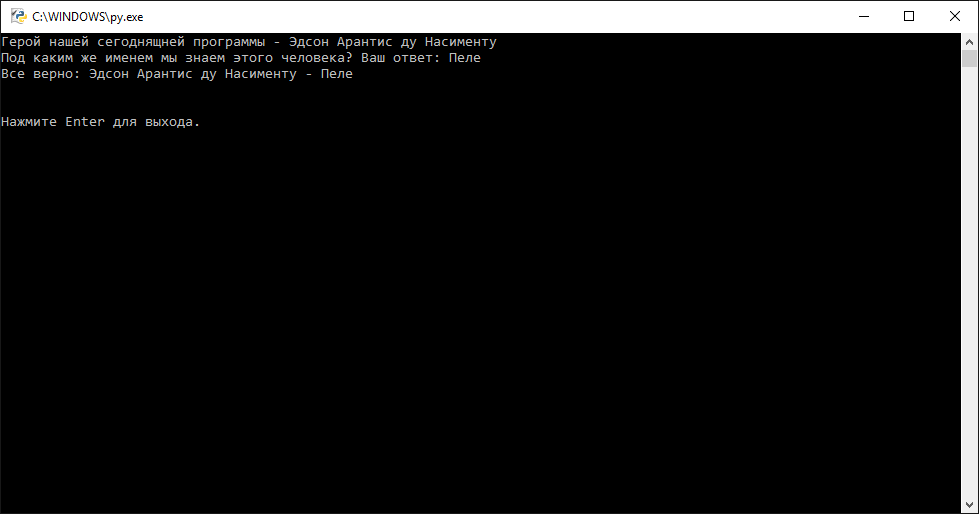

# Типы данных, переменные и основы ввода-вывода

## Задача 3

1. Напишите программу, которая выводит имя "Иво Ливи", и запрашивает его псевдоним. Программа должна сцеплять две эти строки и выводить полученную строку, разделяя имя и псевдоним с помощью тире.

1. Напишите программу, которая выводит имя "Мария Луиза Чеччарелли", и запрашивает его псевдоним. Программа должна сцеплять две эти строки и выводить полученную строку, разделяя имя и псевдоним с помощью тире.

1. Напишите программу, которая выводит имя "Чарльз Лютвидж Доджсон", и запрашивает его псевдоним. Программа должна сцеплять две эти строки и выводить полученную строку, разделяя имя и псевдоним с помощью тире.

1. Напишите программу, которая выводит имя "Уильям Сидни Портер", и запрашивает его псевдоним. Программа должна сцеплять две эти строки и выводить полученную строку, разделяя имя и псевдоним с помощью тире.

1. Напишите программу, которая выводит имя "Жан Батист Поклен", и запрашивает его псевдоним. Программа должна сцеплять две эти строки и выводить полученную строку, разделяя имя и псевдоним с помощью тире.

1. Напишите программу, которая выводит имя "Самюэл Ленгхорн Клеменс", и запрашивает его псевдоним. Программа должна сцеплять две эти строки и выводить полученную строку, разделяя имя и псевдоним с помощью тире.

1. Напишите программу, которая выводит имя "Мэри Анн Эванс", и запрашивает его псевдоним. Программа должна сцеплять две эти строки и выводить полученную строку, разделяя имя и псевдоним с помощью тире.

1. Напишите программу, которая выводит имя "Борис Николаевич Бугаев", и запрашивает его псевдоним. Программа должна сцеплять две эти строки и выводить полученную строку, разделяя имя и псевдоним с помощью тире.

1. Напишите программу, которая выводит имя "Доменико Теотокопули", и запрашивает его псевдоним. Программа должна сцеплять две эти строки и выводить полученную строку, разделяя имя и псевдоним с помощью тире.

1. Напишите программу, которая выводит имя "Игорь Васильевич Лотарев", и запрашивает его псевдоним. Программа должна сцеплять две эти строки и выводить полученную строку, разделяя имя и псевдоним с помощью тире.

1. Напишите программу, которая выводит имя "Анна Андреевна Горенко", и запрашивает его псевдоним. Программа должна сцеплять две эти строки и выводить полученную строку, разделяя имя и псевдоним с помощью тире.

1. Напишите программу, которая выводит имя "Тициано Вечеллио", и запрашивает его псевдоним. Программа должна сцеплять две эти строки и выводить полученную строку, разделяя имя и псевдоним с помощью тире.

1. Напишите программу, которая выводит имя "Норма Бейкер", и запрашивает его псевдоним. Программа должна сцеплять две эти строки и выводить полученную строку, разделяя имя и псевдоним с помощью тире.

1. Напишите программу, которая выводит имя "Вильгельм Аполлинарий Костровицкий", и запрашивает его псевдоним. Программа должна сцеплять две эти строки и выводить полученную строку, разделяя имя и псевдоним с помощью тире.

1. Напишите программу, которая выводит имя "Лариса Петровна Косач-Квитка", и запрашивает его псевдоним. Программа должна сцеплять две эти строки и выводить полученную строку, разделяя имя и псевдоним с помощью тире.

1. Напишите программу, которая выводит имя "Мария Луиза Полякова — Байдарова", и запрашивает его псевдоним. Программа должна сцеплять две эти строки и выводить полученную строку, разделяя имя и псевдоним с помощью тире.

1. Напишите программу, которая выводит имя "Симона Руссель", и запрашивает его псевдоним. Программа должна сцеплять две эти строки и выводить полученную строку, разделяя имя и псевдоним с помощью тире.

1. Напишите программу, которая выводит имя "Михаил Ефимович Фрилянд", и запрашивает его псевдоним. Программа должна сцеплять две эти строки и выводить полученную строку, разделяя имя и псевдоним с помощью тире.

1. Напишите программу, которая выводит имя "Михаил Николаевич Румянцев", и запрашивает его псевдоним. Программа должна сцеплять две эти строки и выводить полученную строку, разделяя имя и псевдоним с помощью тире.

1. Напишите программу, которая выводит имя "Мария Магдалена фон Лош", и запрашивает его псевдоним. Программа должна сцеплять две эти строки и выводить полученную строку, разделяя имя и псевдоним с помощью тире.

1. Напишите программу, которая выводит имя "Аркадий Петрович Голиков", и запрашивает его псевдоним. Программа должна сцеплять две эти строки и выводить полученную строку, разделяя имя и псевдоним с помощью тире.

1. Напишите программу, которая выводит имя "Филип Ауреол Теофраст Бомбаст фон Гогенгейм", и запрашивает его псевдоним. Программа должна сцеплять две эти строки и выводить полученную строку, разделяя имя и псевдоним с помощью тире.

1. Напишите программу, которая выводит имя "София Шиколоне", и запрашивает его псевдоним. Программа должна сцеплять две эти строки и выводить полученную строку, разделяя имя и псевдоним с помощью тире.

1. Напишите программу, которая выводит имя "Максимилиан Гольдман", и запрашивает его псевдоним. Программа должна сцеплять две эти строки и выводить полученную строку, разделяя имя и псевдоним с помощью тире.

1. Напишите программу, которая выводит имя "Алессандро Филипели", и запрашивает его псевдоним. Программа должна сцеплять две эти строки и выводить полученную строку, разделяя имя и псевдоним с помощью тире.

1. Напишите программу, которая выводит имя "Ричард Дженкинс", и запрашивает его псевдоним. Программа должна сцеплять две эти строки и выводить полученную строку, разделяя имя и псевдоним с помощью тире.

1. Напишите программу, которая выводит имя "Михаил Евграфович Салтыков", и запрашивает его псевдоним. Программа должна сцеплять две эти строки и выводить полученную строку, разделяя имя и псевдоним с помощью тире.

1. Напишите программу, которая выводит имя "Анри Мари Бейль", и запрашивает его псевдоним. Программа должна сцеплять две эти строки и выводить полученную строку, разделяя имя и псевдоним с помощью тире.

1. Напишите программу, которая выводит имя "Йоханнес Бруфельдт", и запрашивает его псевдоним. Программа должна сцеплять две эти строки и выводить полученную строку, разделяя имя и псевдоним с помощью тире.

1. Напишите программу, которая выводит имя "Илья Арнольдович Файзильберг", и запрашивает его псевдоним. Программа должна сцеплять две эти строки и выводить полученную строку, разделяя имя и псевдоним с помощью тире.

1. Напишите программу, которая выводит имя "Эмиль Эрзог", и запрашивает его псевдоним. Программа должна сцеплять две эти строки и выводить полученную строку, разделяя имя и псевдоним с помощью тире.

1. Напишите программу, которая выводит имя "Фредерик Аустерлиц", и запрашивает его псевдоним. Программа должна сцеплять две эти строки и выводить полученную строку, разделяя имя и псевдоним с помощью тире.

1. Напишите программу, которая выводит имя "Эжен Грендель", и запрашивает его псевдоним. Программа должна сцеплять две эти строки и выводить полученную строку, разделяя имя и псевдоним с помощью тире.

1. Напишите программу, которая выводит имя "Александр Михайлович Гликберг", и запрашивает его псевдоним. Программа должна сцеплять две эти строки и выводить полученную строку, разделяя имя и псевдоним с помощью тире.

1. Напишите программу, которая выводит имя "Эдуард Георгиевич Зюбин", и запрашивает его псевдоним. Программа должна сцеплять две эти строки и выводить полученную строку, разделяя имя и псевдоним с помощью тире.

1. Напишите программу, которая выводит имя "Грета Густафсон", и запрашивает его псевдоним. Программа должна сцеплять две эти строки и выводить полученную строку, разделяя имя и псевдоним с помощью тире.

1. Напишите программу, которая выводит имя "Ефим Алексеевич Придворов", и запрашивает его псевдоним. Программа должна сцеплять две эти строки и выводить полученную строку, разделяя имя и псевдоним с помощью тире.

1. Напишите программу, которая выводит имя "Конрад Джозеф Английский писатель Юзеф Теодор Конрад Коженевский", и запрашивает его псевдоним. Программа должна сцеплять две эти строки и выводить полученную строку, разделяя имя и псевдоним с помощью тире.

1. Напишите программу, которая выводит имя "Джон Гриффит Лондон", и запрашивает его псевдоним. Программа должна сцеплять две эти строки и выводить полученную строку, разделяя имя и псевдоним с помощью тире.

1. Напишите программу, которая выводит имя "Евгений Петрович Катаев", и запрашивает его псевдоним. Программа должна сцеплять две эти строки и выводить полученную строку, разделяя имя и псевдоним с помощью тире.

1. Напишите программу, которая выводит имя "Арнольд Фит фон Гальсенау", и запрашивает его псевдоним. Программа должна сцеплять две эти строки и выводить полученную строку, разделяя имя и псевдоним с помощью тире.

1. Напишите программу, которая выводит имя "Янис Плиекшанс", и запрашивает его псевдоним. Программа должна сцеплять две эти строки и выводить полученную строку, разделяя имя и псевдоним с помощью тире.

1. Напишите программу, которая выводит имя "Франсуаза Сориа", и запрашивает его псевдоним. Программа должна сцеплять две эти строки и выводить полученную строку, разделяя имя и псевдоним с помощью тире.

1. Напишите программу, которая выводит имя "Мари Фрасуа Аруэ", и запрашивает его псевдоним. Программа должна сцеплять две эти строки и выводить полученную строку, разделяя имя и псевдоним с помощью тире.

1. Напишите программу, которая выводит имя "Мартин Андерсен", и запрашивает его псевдоним. Программа должна сцеплять две эти строки и выводить полученную строку, разделяя имя и псевдоним с помощью тире.

1. Напишите программу, которая выводит имя "Аврора Жюпен", и запрашивает его псевдоним. Программа должна сцеплять две эти строки и выводить полученную строку, разделяя имя и псевдоним с помощью тире.

1. Напишите программу, которая выводит имя "Герхард Герхардс", и запрашивает его псевдоним. Программа должна сцеплять две эти строки и выводить полученную строку, разделяя имя и псевдоним с помощью тире.

1. Напишите программу, которая выводит имя "Борис Николаевич Кампов", и запрашивает его псевдоним. Программа должна сцеплять две эти строки и выводить полученную строку, разделяя имя и псевдоним с помощью тире.

1. Напишите программу, которая выводит имя "Алексей Максимович Пешков", и запрашивает его псевдоним. Программа должна сцеплять две эти строки и выводить полученную строку, разделяя имя и псевдоним с помощью тире.

1. Напишите программу, которая выводит имя "Саид-Мурадзола Садриддин", и запрашивает его псевдоним. Программа должна сцеплять две эти строки и выводить полученную строку, разделяя имя и псевдоним с помощью тире.

## Задача 4

1. Напишите программу, которая выводит имя настоящее Иво Ливи. Дополнительно необходимо вывести область интересов указанной личности, место рождения, годы рождения и смерти (если человек умер), вычислить возраст на данный момент (или момент смерти). После вывода информации программа должна дожидаться пока пользователь нажмет Enter для выхода.

1. Напишите программу, которая выводит имя настоящее Михаил Евграфович Салтыков. Дополнительно необходимо вывести область интересов указанной личности, место рождения, годы рождения и смерти (если человек умер), вычислить возраст на данный момент (или момент смерти). После вывода информации программа должна дожидаться пока пользователь нажмет Enter для выхода.

1. Напишите программу, которая выводит имя настоящее Алессандро Филипели. Дополнительно необходимо вывести область интересов указанной личности, место рождения, годы рождения и смерти (если человек умер), вычислить возраст на данный момент (или момент смерти). После вывода информации программа должна дожидаться пока пользователь нажмет Enter для выхода.

1. Напишите программу, которая выводит имя настоящее Джон Гриффит Лондон. Дополнительно необходимо вывести область интересов указанной личности, место рождения, годы рождения и смерти (если человек умер), вычислить возраст на данный момент (или момент смерти). После вывода информации программа должна дожидаться пока пользователь нажмет Enter для выхода.

1. Напишите программу, которая выводит имя настоящее Фредерик Аустерлиц. Дополнительно необходимо вывести область интересов указанной личности, место рождения, годы рождения и смерти (если человек умер), вычислить возраст на данный момент (или момент смерти). После вывода информации программа должна дожидаться пока пользователь нажмет Enter для выхода.

1. Напишите программу, которая выводит имя настоящее София Шиколоне. Дополнительно необходимо вывести область интересов указанной личности, место рождения, годы рождения и смерти (если человек умер), вычислить возраст на данный момент (или момент смерти). После вывода информации программа должна дожидаться пока пользователь нажмет Enter для выхода.

1. Напишите программу, которая выводит имя настоящее Мария Луиза Чеччарелли. Дополнительно необходимо вывести область интересов указанной личности, место рождения, годы рождения и смерти (если человек умер), вычислить возраст на данный момент (или момент смерти). После вывода информации программа должна дожидаться пока пользователь нажмет Enter для выхода.

1. Напишите программу, которая выводит имя настоящее Алексей Максимович Пешков. Дополнительно необходимо вывести область интересов указанной личности, место рождения, годы рождения и смерти (если человек умер), вычислить возраст на данный момент (или момент смерти). После вывода информации программа должна дожидаться пока пользователь нажмет Enter для выхода.

1. Напишите программу, которая выводит имя настоящее Михаил Николаевич Румянцев. Дополнительно необходимо вывести область интересов указанной личности, место рождения, годы рождения и смерти (если человек умер), вычислить возраст на данный момент (или момент смерти). После вывода информации программа должна дожидаться пока пользователь нажмет Enter для выхода.

1. Напишите программу, которая выводит имя настоящее Уильям Сидни Портер. Дополнительно необходимо вывести область интересов указанной личности, место рождения, годы рождения и смерти (если человек умер), вычислить возраст на данный момент (или момент смерти). После вывода информации программа должна дожидаться пока пользователь нажмет Enter для выхода.

1. Напишите программу, которая выводит имя настоящее Йоханнес Бруфельдт. Дополнительно необходимо вывести область интересов указанной личности, место рождения, годы рождения и смерти (если человек умер), вычислить возраст на данный момент (или момент смерти). После вывода информации программа должна дожидаться пока пользователь нажмет Enter для выхода.

1. Напишите программу, которая выводит имя настоящее Лариса Петровна Косач-Квитка. Дополнительно необходимо вывести область интересов указанной личности, место рождения, годы рождения и смерти (если человек умер), вычислить возраст на данный момент (или момент смерти). После вывода информации программа должна дожидаться пока пользователь нажмет Enter для выхода.

1. Напишите программу, которая выводит имя настоящее Жан Батист Поклен. Дополнительно необходимо вывести область интересов указанной личности, место рождения, годы рождения и смерти (если человек умер), вычислить возраст на данный момент (или момент смерти). После вывода информации программа должна дожидаться пока пользователь нажмет Enter для выхода.

1. Напишите программу, которая выводит имя настоящее Михаил Ефимович Фрилянд. Дополнительно необходимо вывести область интересов указанной личности, место рождения, годы рождения и смерти (если человек умер), вычислить возраст на данный момент (или момент смерти). После вывода информации программа должна дожидаться пока пользователь нажмет Enter для выхода.

1. Напишите программу, которая выводит имя настоящее Анри Мари Бейль. Дополнительно необходимо вывести область интересов указанной личности, место рождения, годы рождения и смерти (если человек умер), вычислить возраст на данный момент (или момент смерти). После вывода информации программа должна дожидаться пока пользователь нажмет Enter для выхода.

1. Напишите программу, которая выводит имя настоящее Мартин Андерсен. Дополнительно необходимо вывести область интересов указанной личности, место рождения, годы рождения и смерти (если человек умер), вычислить возраст на данный момент (или момент смерти). После вывода информации программа должна дожидаться пока пользователь нажмет Enter для выхода.

1. Напишите программу, которая выводит имя настоящее Грета Густафсон. Дополнительно необходимо вывести область интересов указанной личности, место рождения, годы рождения и смерти (если человек умер), вычислить возраст на данный момент (или момент смерти). После вывода информации программа должна дожидаться пока пользователь нажмет Enter для выхода.

1. Напишите программу, которая выводит имя настоящее Янис Плиекшанс. Дополнительно необходимо вывести область интересов указанной личности, место рождения, годы рождения и смерти (если человек умер), вычислить возраст на данный момент (или момент смерти). После вывода информации программа должна дожидаться пока пользователь нажмет Enter для выхода.

1. Напишите программу, которая выводит имя настоящее Ричард Дженкинс. Дополнительно необходимо вывести область интересов указанной личности, место рождения, годы рождения и смерти (если человек умер), вычислить возраст на данный момент (или момент смерти). После вывода информации программа должна дожидаться пока пользователь нажмет Enter для выхода.

1. Напишите программу, которая выводит имя настоящее Мари Фрасуа Аруэ. Дополнительно необходимо вывести область интересов указанной личности, место рождения, годы рождения и смерти (если человек умер), вычислить возраст на данный момент (или момент смерти). После вывода информации программа должна дожидаться пока пользователь нажмет Enter для выхода.

1. Напишите программу, которая выводит имя настоящее Филип Ауреол Теофраст Бомбаст фон Гогенгейм. Дополнительно необходимо вывести область интересов указанной личности, место рождения, годы рождения и смерти (если человек умер), вычислить возраст на данный момент (или момент смерти). После вывода информации программа должна дожидаться пока пользователь нажмет Enter для выхода.

1. Напишите программу, которая выводит имя настоящее Самюэл Ленгхорн Клеменс. Дополнительно необходимо вывести область интересов указанной личности, место рождения, годы рождения и смерти (если человек умер), вычислить возраст на данный момент (или момент смерти). После вывода информации программа должна дожидаться пока пользователь нажмет Enter для выхода.

1. Напишите программу, которая выводит имя настоящее Илья Арнольдович Файзильберг. Дополнительно необходимо вывести область интересов указанной личности, место рождения, годы рождения и смерти (если человек умер), вычислить возраст на данный момент (или момент смерти). После вывода информации программа должна дожидаться пока пользователь нажмет Enter для выхода.

1. Напишите программу, которая выводит имя настоящее Ефим Алексеевич Придворов. Дополнительно необходимо вывести область интересов указанной личности, место рождения, годы рождения и смерти (если человек умер), вычислить возраст на данный момент (или момент смерти). После вывода информации программа должна дожидаться пока пользователь нажмет Enter для выхода.

1. Напишите программу, которая выводит имя настоящее Мэри Анн Эванс. Дополнительно необходимо вывести область интересов указанной личности, место рождения, годы рождения и смерти (если человек умер), вычислить возраст на данный момент (или момент смерти). После вывода информации программа должна дожидаться пока пользователь нажмет Enter для выхода.

1. Напишите программу, которая выводит имя настоящее Аркадий Петрович Голиков. Дополнительно необходимо вывести область интересов указанной личности, место рождения, годы рождения и смерти (если человек умер), вычислить возраст на данный момент (или момент смерти). После вывода информации программа должна дожидаться пока пользователь нажмет Enter для выхода.

1. Напишите программу, которая выводит имя настоящее Доменико Теотокопули. Дополнительно необходимо вывести область интересов указанной личности, место рождения, годы рождения и смерти (если человек умер), вычислить возраст на данный момент (или момент смерти). После вывода информации программа должна дожидаться пока пользователь нажмет Enter для выхода.

1. Напишите программу, которая выводит имя настоящее Эдуард Георгиевич Зюбин. Дополнительно необходимо вывести область интересов указанной личности, место рождения, годы рождения и смерти (если человек умер), вычислить возраст на данный момент (или момент смерти). После вывода информации программа должна дожидаться пока пользователь нажмет Enter для выхода.

1. Напишите программу, которая выводит имя настоящее Эмиль Эрзог. Дополнительно необходимо вывести область интересов указанной личности, место рождения, годы рождения и смерти (если человек умер), вычислить возраст на данный момент (или момент смерти). После вывода информации программа должна дожидаться пока пользователь нажмет Enter для выхода.

1. Напишите программу, которая выводит имя настоящее Вильгельм Аполлинарий Костровицкий. Дополнительно необходимо вывести область интересов указанной личности, место рождения, годы рождения и смерти (если человек умер), вычислить возраст на данный момент (или момент смерти). После вывода информации программа должна дожидаться пока пользователь нажмет Enter для выхода.

1. Напишите программу, которая выводит имя настоящее Анна Андреевна Горенко. Дополнительно необходимо вывести область интересов указанной личности, место рождения, годы рождения и смерти (если человек умер), вычислить возраст на данный момент (или момент смерти). После вывода информации программа должна дожидаться пока пользователь нажмет Enter для выхода.

1. Напишите программу, которая выводит имя настоящее Конрад Джозеф Английский писатель Юзеф Теодор Конрад Коженевский. Дополнительно необходимо вывести область интересов указанной личности, место рождения, годы рождения и смерти (если человек умер), вычислить возраст на данный момент (или момент смерти). После вывода информации программа должна дожидаться пока пользователь нажмет Enter для выхода.

1. Напишите программу, которая выводит имя настоящее Мария Магдалена фон Лош. Дополнительно необходимо вывести область интересов указанной личности, место рождения, годы рождения и смерти (если человек умер), вычислить возраст на данный момент (или момент смерти). После вывода информации программа должна дожидаться пока пользователь нажмет Enter для выхода.

1. Напишите программу, которая выводит имя настоящее Мария Луиза Полякова — Байдарова. Дополнительно необходимо вывести область интересов указанной личности, место рождения, годы рождения и смерти (если человек умер), вычислить возраст на данный момент (или момент смерти). После вывода информации программа должна дожидаться пока пользователь нажмет Enter для выхода.

1. Напишите программу, которая выводит имя настоящее Тициано Вечеллио. Дополнительно необходимо вывести область интересов указанной личности, место рождения, годы рождения и смерти (если человек умер), вычислить возраст на данный момент (или момент смерти). После вывода информации программа должна дожидаться пока пользователь нажмет Enter для выхода.

1. Напишите программу, которая выводит имя настоящее Эжен Грендель. Дополнительно необходимо вывести область интересов указанной личности, место рождения, годы рождения и смерти (если человек умер), вычислить возраст на данный момент (или момент смерти). После вывода информации программа должна дожидаться пока пользователь нажмет Enter для выхода.

1. Напишите программу, которая выводит имя настоящее Александр Михайлович Гликберг. Дополнительно необходимо вывести область интересов указанной личности, место рождения, годы рождения и смерти (если человек умер), вычислить возраст на данный момент (или момент смерти). После вывода информации программа должна дожидаться пока пользователь нажмет Enter для выхода.

1. Напишите программу, которая выводит имя настоящее Симона Руссель. Дополнительно необходимо вывести область интересов указанной личности, место рождения, годы рождения и смерти (если человек умер), вычислить возраст на данный момент (или момент смерти). После вывода информации программа должна дожидаться пока пользователь нажмет Enter для выхода.

1. Напишите программу, которая выводит имя настоящее Евгений Петрович Катаев. Дополнительно необходимо вывести область интересов указанной личности, место рождения, годы рождения и смерти (если человек умер), вычислить возраст на данный момент (или момент смерти). После вывода информации программа должна дожидаться пока пользователь нажмет Enter для выхода.

1. Напишите программу, которая выводит имя настоящее Норма Бейкер. Дополнительно необходимо вывести область интересов указанной личности, место рождения, годы рождения и смерти (если человек умер), вычислить возраст на данный момент (или момент смерти). После вывода информации программа должна дожидаться пока пользователь нажмет Enter для выхода.

1. Напишите программу, которая выводит имя настоящее Игорь Васильевич Лотарев. Дополнительно необходимо вывести область интересов указанной личности, место рождения, годы рождения и смерти (если человек умер), вычислить возраст на данный момент (или момент смерти). После вывода информации программа должна дожидаться пока пользователь нажмет Enter для выхода.

1. Напишите программу, которая выводит имя настоящее Арнольд Фит фон Гальсенау. Дополнительно необходимо вывести область интересов указанной личности, место рождения, годы рождения и смерти (если человек умер), вычислить возраст на данный момент (или момент смерти). После вывода информации программа должна дожидаться пока пользователь нажмет Enter для выхода.

1. Напишите программу, которая выводит имя настоящее Франсуаза Сориа. Дополнительно необходимо вывести область интересов указанной личности, место рождения, годы рождения и смерти (если человек умер), вычислить возраст на данный момент (или момент смерти). После вывода информации программа должна дожидаться пока пользователь нажмет Enter для выхода.

1. Напишите программу, которая выводит имя настоящее Борис Николаевич Бугаев. Дополнительно необходимо вывести область интересов указанной личности, место рождения, годы рождения и смерти (если человек умер), вычислить возраст на данный момент (или момент смерти). После вывода информации программа должна дожидаться пока пользователь нажмет Enter для выхода.

1. Напишите программу, которая выводит имя настоящее Борис Николаевич Кампов. Дополнительно необходимо вывести область интересов указанной личности, место рождения, годы рождения и смерти (если человек умер), вычислить возраст на данный момент (или момент смерти). После вывода информации программа должна дожидаться пока пользователь нажмет Enter для выхода.

1. Напишите программу, которая выводит имя настоящее Чарльз Лютвидж Доджсон. Дополнительно необходимо вывести область интересов указанной личности, место рождения, годы рождения и смерти (если человек умер), вычислить возраст на данный момент (или момент смерти). После вывода информации программа должна дожидаться пока пользователь нажмет Enter для выхода.

1. Напишите программу, которая выводит имя настоящее Аврора Жюпен. Дополнительно необходимо вывести область интересов указанной личности, место рождения, годы рождения и смерти (если человек умер), вычислить возраст на данный момент (или момент смерти). После вывода информации программа должна дожидаться пока пользователь нажмет Enter для выхода.

1. Напишите программу, которая выводит имя настоящее Герхард Герхардс. Дополнительно необходимо вывести область интересов указанной личности, место рождения, годы рождения и смерти (если человек умер), вычислить возраст на данный момент (или момент смерти). После вывода информации программа должна дожидаться пока пользователь нажмет Enter для выхода.

1. Напишите программу, которая выводит имя настоящее Саид-Мурадзола Садриддин. Дополнительно необходимо вывести область интересов указанной личности, место рождения, годы рождения и смерти (если человек умер), вычислить возраст на данный момент (или момент смерти). После вывода информации программа должна дожидаться пока пользователь нажмет Enter для выхода.

1. Напишите программу, которая выводит имя настоящее Максимилиан Гольдман. Дополнительно необходимо вывести область интересов указанной личности, место рождения, годы рождения и смерти (если человек умер), вычислить возраст на данный момент (или момент смерти). После вывода информации программа должна дожидаться пока пользователь нажмет Enter для выхода.