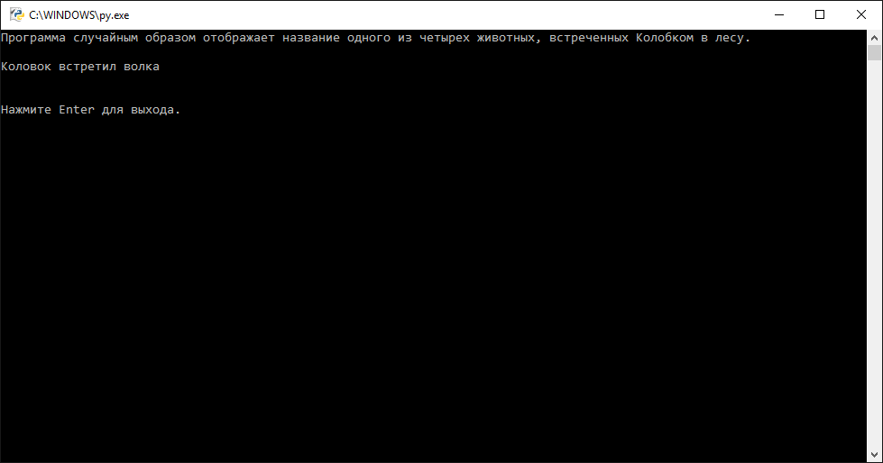
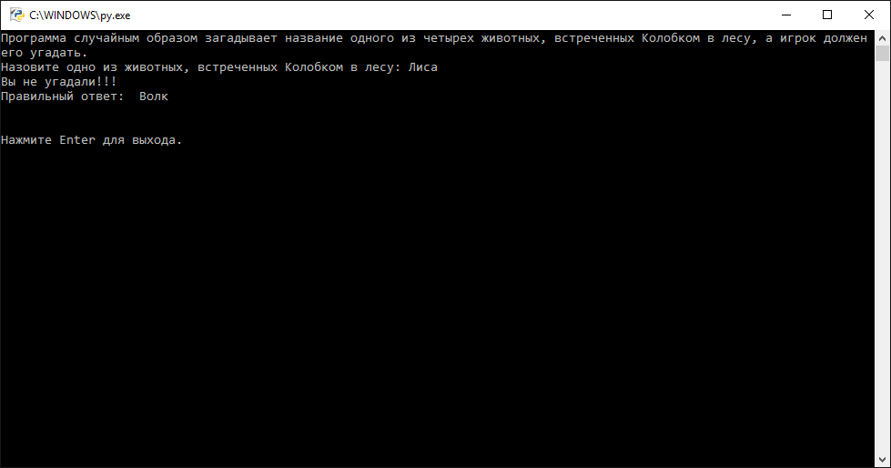
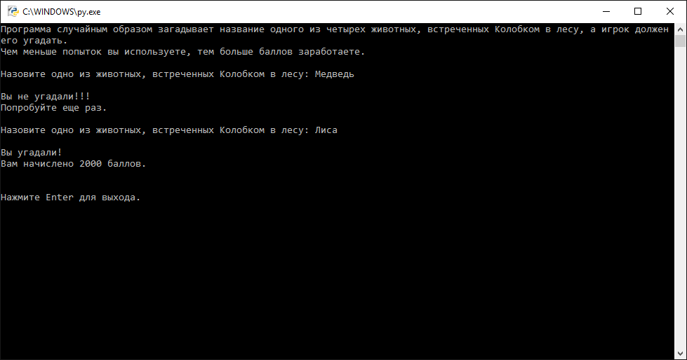

# Ветвления и циклы

## Задача 5

1. Напишите программу, которая бы при запуске случайным образом отображала название одного из семи чудес света.

1. Напишите программу, которая бы при запуске случайным образом отображала имя одного из трех поросят.

1. Напишите программу, которая бы при запуске случайным образом отображала название одного из цветов радуги.

1. Напишите программу, которая бы при запуске случайным образом отображала один из трех цветов светофора.

1. Напишите программу, которая бы при запуске случайным образом отображала название одного из восьми соборов Московского кремля.

1. Напишите программу, которая бы при запуске случайным образом отображала название одного из двух спутников Марса.

1. Напишите программу, которая бы при запуске случайным образом отображала имя одного из семи гномов, друзей Белоснежки.

1. Напишите программу, которая бы при запуске случайным образом отображала название одного из семи дней недели.

1. Напишите программу, которая бы при запуске случайным образом отображала название одной из трех стран, входящих в военно-политический блок "Антанта".

1. Напишите программу, которая бы при запуске случайным образом отображала название одного из шести континентов Земли.

1. Напишите программу, которая бы при запуске случайным образом отображала имя одного из девяти оленей Санта Клауса.

1. Напишите программу, которая бы при запуске случайным образом отображала название одного из двенадцати подвигов Геракла.

1. Напишите программу, которая бы при запуске случайным образом отображала имя одного из двенадцати апостолов.

1. Напишите программу, которая бы при запуске случайным образом отображала название одной из двадцати башен Московского кремля.

1. Напишите программу, которая бы при запуске случайным образом отображала название одного из двенадцати городов, входящих в Золотое кольцо России.

1. Напишите программу, которая бы при запуске случайным образом отображала имя одной из девяти муз в древнегреческой мифологии.

1. Напишите программу, которая бы при запуске случайным образом отображала название одной из трех стран, входящих в военно-политический блок "Тройственный союз".

1. Напишите программу, которая бы при запуске случайным образом отображала название одного из двенадцати созвездий, входящих в зодиакальный круг.

1. Напишите программу, которая бы при запуске случайным образом отображала название одной из восьми планет Солнечной системы.

1. Напишите программу, которая бы при запуске случайным образом отображала имя одного из трех мушкетеров - товарищей д'Артаньяна.

1. Напишите программу, которая бы при запуске случайным образом отображала название одной из двадцати восьми стран, входящих в Европейский союз.

1. Напишите программу, которая бы при запуске случайным образом отображала имя одного из двух сооснователей компании Google.

1. Напишите программу, которая бы при запуске случайным образом отображала имя одной из трех официальных жен Зевса.

1. Напишите программу, которая бы при запуске случайным образом отображала название одной из шести шахматных фигур.

1. Напишите программу, которая бы при запуске случайным образом отображала название одной из пятнадцати республик, входящих в состав СССР.

1. Напишите программу, которая бы при запуске случайным образом отображала имена двух братьев, легендарных основателей Рима.

1. Напишите программу, которая бы при запуске случайным образом отображала название одного из двенадцати месяцев.

1. Напишите программу, которая бы при запуске случайным образом отображала имя одного из четырех основателей группы The Beatles.

1. Напишите программу, которая бы при запуске случайным образом отображала имя одного из пяти членов экипажей программы "Союз - Апполон".

1. Напишите программу, которая бы при запуске случайным образом отображала имя одного из трех племянников Скруджа МакДака.

1. Напишите программу, которая бы при запуске случайным образом отображала имя одного из двух братьев, создателей старославянской азбуки.

1. Напишите программу, которая бы при запуске случайным образом отображала имя одного из шестнадцати официальных чемпионов Мира по шахматам.

1. Напишите программу, которая бы при запуске случайным образом отображала имя одной из шести официальных жен Ивана IV Грозного.

1. Напишите программу, которая бы при запуске случайным образом отображала имя одного из шести генеральных секретарей ЦК КПСС.

1. Напишите программу, которая бы при запуске случайным образом отображала название одной из двенадцати линий московского метрополитена.

1. Напишите программу, которая бы при запуске случайным образом отображала имя одного из трех официальных талисманов зимних Олимпийских игр 2014 года в Сочи.

1. Напишите программу, которая бы при запуске случайным образом отображала название одного из пяти космических челноков проекта Спейс шаттл.

1. Напишите программу, которая бы при запуске случайным образом отображала имя одной из семи птиц, доступных с первой версии игры Angry Birds.

1. Напишите программу, которая бы при запуске случайным образом отображала название одной из четырех основных мастей лошадей.

1. Напишите программу, которая бы при запуске случайным образом отображала название одного из четырнадцати гражданских чинов, занесенных в Петровскую «Табель о рангах» .

1. Напишите программу, которая бы при запуске случайным образом отображала название одного из семи городов России, имеющих действующий метрополитен.

1. Напишите программу, которая бы при запуске случайным образом отображала название одной из тринадцати британских колоний, подписавших в 1776 году Декларацию независимости и образовавших США.

1. Напишите программу, которая бы при запуске случайным образом отображала название одного из семи холмов, на которых по легенде XVI века была построена Москва.

1. Напишите программу, которая бы при запуске случайным образом отображала название одной из семи основных физических единиц, согласно Международной системы единиц .

1. Напишите программу, которая бы при запуске случайным образом отображала имя одного из четырех черепашек-ниндзя.

1. Напишите программу, которая бы при запуске случайным образом отображала имя одного из семи мишек Гамми.

1. Напишите программу, которая бы при запуске случайным образом отображала название одного из четырех океанов Земли.

1. Напишите программу, которая бы при запуске случайным образом отображала название одного из восьми категорий, на которые разделяются дорожные знаки в соответствии с Венской конвенцией о дорожных знаках и сигналах.

1. Напишите программу, которая бы при запуске случайным образом отображала название одного из девяти действующих вокзалов Москвы.

1. Напишите программу, которая бы при запуске случайным образом отображала название одной их четырех карточных мастей стандартной французской колоды.

## Задача 6

1. Создайте игру, в которой компьютер загадывает имя одного из трех мушкетеров - товарищей д'Артаньяна, а игрок должен его угадать.
1. Создайте игру, в которой компьютер загадывает название одного из двенадцати созвездий, входящих в зодиакальный круг, а игрок должен его угадать.
1. Создайте игру, в которой компьютер загадывает имя одной из семи птиц, доступных с первой версии игры Angry Birds, а игрок должен его угадать.
1. Создайте игру, в которой компьютер загадывает название одного из двенадцати подвигов Геракла, а игрок должен его угадать.
1. Создайте игру, в которой компьютер загадывает один из трех цветов светофора, а игрок должен его угадать.
1. Создайте игру, в которой компьютер загадывает название одного из семи городов России, имеющих действующий метрополитен, а игрок должен его угадать.
1. Создайте игру, в которой компьютер загадывает имя одного из двух сооснователей компании Google, а игрок должен его угадать.
1. Создайте игру, в которой компьютер загадывает название одного из семи холмов, на которых по легенде XVI века была построена Москва, а игрок должен его угадать.
1. Создайте игру, в которой компьютер загадывает имя одного из трех поросят, а игрок должен его угадать.
1. Создайте игру, в которой компьютер загадывает название одной из трех стран, входящих в военно-политический блок "Тройственный союз", а игрок должен его угадать.
1. Создайте игру, в которой компьютер загадывает название одного из девяти действующих вокзалов Москвы, а игрок должен его угадать.
1. Создайте игру, в которой компьютер загадывает название одного из восьми соборов Московского кремля, а игрок должен его угадать.
1. Создайте игру, в которой компьютер загадывает название одного из двух спутников Марса, а игрок должен его угадать.
1. Создайте игру, в которой компьютер загадывает имя одного из трех официальных талисманов зимних Олимпийских игр 2014 года в Сочи, а игрок должен его угадать.
1. Создайте игру, в которой компьютер загадывает название одного из двенадцати городов, входящих в Золотое кольцо России, а игрок должен его угадать.
1. Создайте игру, в которой компьютер загадывает имя одной из шести официальных жен Ивана IV Грозного, а игрок должен его угадать.
1. Создайте игру, в которой компьютер загадывает название одного из пяти космических челноков проекта Спейс шаттл, а игрок должен его угадать.
1. Создайте игру, в которой компьютер загадывает имя одной из трех официальных жен Зевса, а игрок должен его угадать.
1. Создайте игру, в которой компьютер загадывает название одной из шести шахматных фигур, а игрок должен его угадать.
1. Создайте игру, в которой компьютер загадывает имя одного из семи гномов, друзей Белоснежки, а игрок должен его угадать.
1. Создайте игру, в которой компьютер загадывает название одной из семи основных физических единиц, согласно Международной системы единиц  , а игрок должен его угадать.
1. Создайте игру, в которой компьютер загадывает имена двух братьев, легендарных основателей Рима, а игрок должен его угадать.
1. Создайте игру, в которой компьютер загадывает название одного из семи дней недели, а игрок должен его угадать.
1. Создайте игру, в которой компьютер загадывает название одной из четырех основных мастей лошадей, а игрок должен его угадать.
1. Создайте игру, в которой компьютер загадывает название одного из четырех океанов Земли, а игрок должен его угадать.
1. Создайте игру, в которой компьютер загадывает название одного из восьми категорий, на которые разделяются дорожные знаки в соответствии с Венской конвенцией о дорожных знаках и сигналах, а игрок должен его угадать.
1. Создайте игру, в которой компьютер загадывает имя одного из двух братьев, создателей старославянской азбуки, а игрок должен его угадать.
1. Создайте игру, в которой компьютер загадывает название одного из шести континентов Земли, а игрок должен его угадать.
1. Создайте игру, в которой компьютер загадывает имя одного из двенадцати апостолов, а игрок должен его угадать.
1. Создайте игру, в которой компьютер загадывает название одного из двенадцати месяцев, а игрок должен его угадать.
1. Создайте игру, в которой компьютер загадывает название одной из восьми планет Солнечной системы, а игрок должен его угадать.
1. Создайте игру, в которой компьютер загадывает название одной из двадцати восьми стран, входящих в Европейский союз, а игрок должен его угадать.
1. Создайте игру, в которой компьютер загадывает название одной их четырех карточных мастей стандартной французской колоды, а игрок должен его угадать.
1. Создайте игру, в которой компьютер загадывает имя одного из трех племянников Скруджа МакДака, а игрок должен его угадать.
1. Создайте игру, в которой компьютер загадывает имя одного из шестнадцати официальных чемпионов Мира по шахматам, а игрок должен его угадать.
1. Создайте игру, в которой компьютер загадывает название одного из цветов радуги, а игрок должен его угадать.
1. Создайте игру, в которой компьютер загадывает имя одного из девяти оленей Санта Клауса, а игрок должен его угадать.
1. Создайте игру, в которой компьютер загадывает имя одной из девяти муз в древнегреческой мифологии, а игрок должен его угадать.
1. Создайте игру, в которой компьютер загадывает имя одного из четырех основателей группы The Beatles, а игрок должен его угадать.
1. Создайте игру, в которой компьютер загадывает название одной из тринадцати британских колоний, подписавших в 1776 году Декларацию независимости и образовавших США, а игрок должен его угадать.
1. Создайте игру, в которой компьютер загадывает имя одного из четырех черепашек-ниндзя, а игрок должен его угадать.
1. Создайте игру, в которой компьютер загадывает имя одного из пяти членов экипажей программы "Союз - Апполон", а игрок должен его угадать.
1. Создайте игру, в которой компьютер загадывает имя одного из семи мишек Гамми, а игрок должен его угадать.
1. Создайте игру, в которой компьютер загадывает имя одного из шести генеральных секретарей ЦК КПСС, а игрок должен его угадать.
1. Создайте игру, в которой компьютер загадывает название одного из семи чудес света, а игрок должен его угадать.
1. Создайте игру, в которой компьютер загадывает название одной из трех стран, входящих в военно-политический блок "Антанта", а игрок должен его угадать.
1. Создайте игру, в которой компьютер загадывает название одной из двенадцати линий московского метрополитена, а игрок должен его угадать.
1. Создайте игру, в которой компьютер загадывает название одной из двадцати башен Московского кремля, а игрок должен его угадать.
1. Создайте игру, в которой компьютер загадывает название одного из четырнадцати гражданских чинов, занесенных в Петровскую «Табель о рангах»  , а игрок должен его угадать.
1. Создайте игру, в которой компьютер загадывает название одной из пятнадцати республик, входящих в состав СССР, а игрок должен его угадать.

## Задача 7

1-50. Разработайте систему начисления очков для задачи 6, в соответствии с которой игрок получал бы большее количество баллов за меньшее количество попыток.